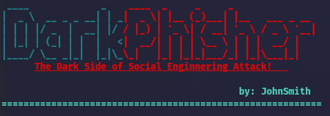
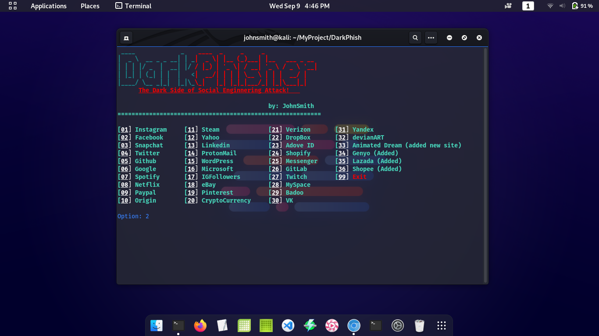
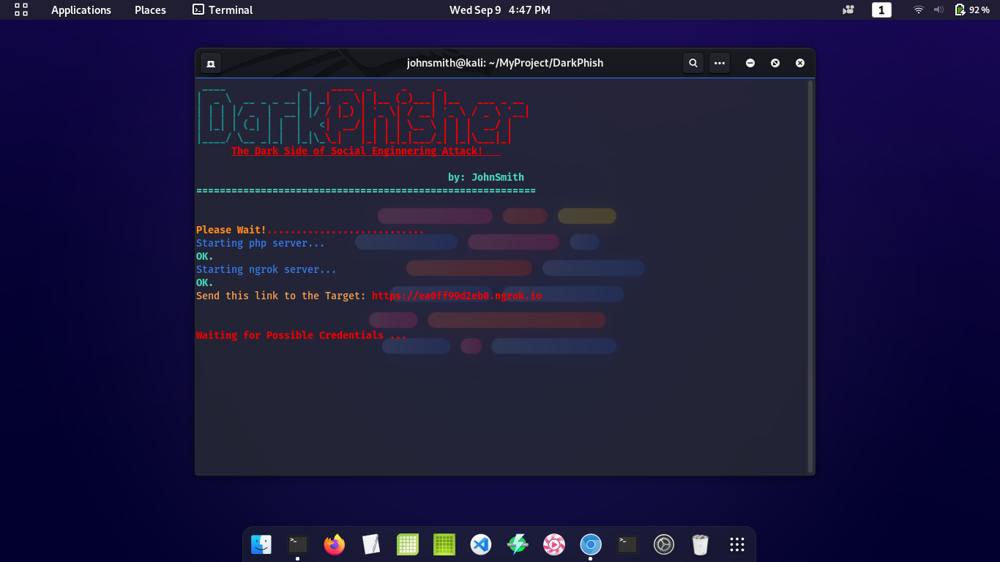
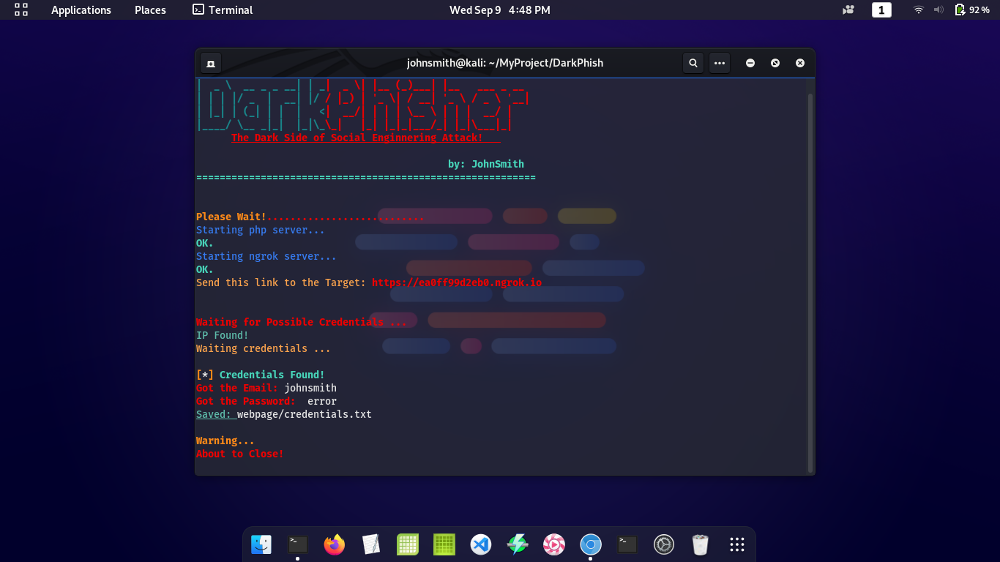

# DarkPhisher
#### darkphisher-phishing script tool created by [johnsmith](https://github.com/johnsmith80) on github advance phishing tool
#### advance phishing attack using NGROK. 36 available Phishing Page!
## Pentester Alert:
#### Warning Do not user for illegal purposes. any illegal use of this tool is not my responsibility.
#### Use for Educational Purposes only. [Issue](https://github.com/johnsmith80/DarkPhisher/issues) and [Pull request](https://github.com/johnsmith80/DarkPhisher/pulls) Please Feel free to ask request add some site's.
## example:





## Usage:
```
  git clone https://github.com/johnsmith80/DarkPhisher.git
  cd DarkPhisher
  ./dependencies.sh
  sudo ./darkphisher.sh
```
#### if ngrok failed or not compatible for your device. download it on there website: [NGROK](https://ngrok.com/)
#### mv on the DarkPhisher directory, unzip the file, then run the dependencies.sh again
```  
  ./dependencies.sh
  sudo ./darkphisher.sh
```

Follow me:
+ [Facebook](https://web.facebook.com/h4ckitnow)
+ [Tiktok](https://www.tiktok.com/@johnsmith0911)
+ [Twitter](https://twitter.com/J0hnSm1th80)
+ [Youtube](https://www.youtube.com/channel/UCV5gF3dWxUOFoGA7P9NGviQ)
